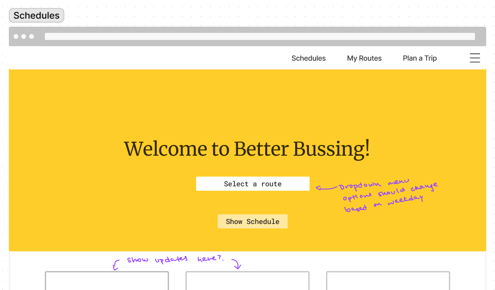
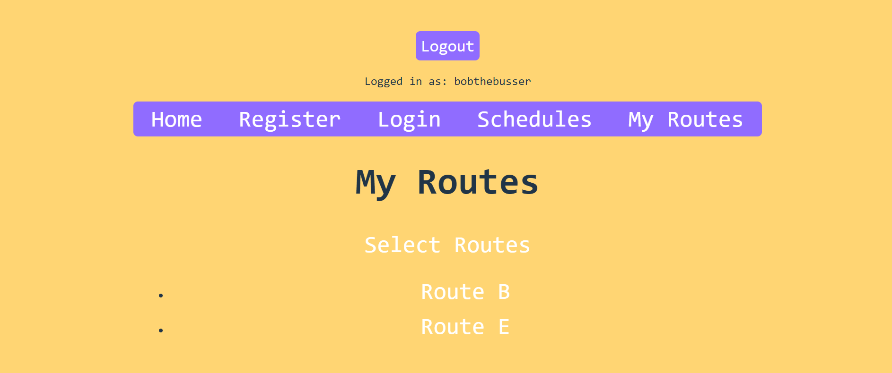

# Better Bussing

## Overview

Better Bussing displays all the NYU bus routes in one web app - no more clicking back and forth
through different spreadsheets to compare routes and times. Users can keep track of their
frequently used routes.

## Data Model

The application will store Users, Favorites and Schedules

* schedules will be created from google sheets files containing stops and times
* each user has list of favorite routes to track, each route corresponds to a schedule

An Example User:

```javascript
{
  username: "bobthebusser",
  hash: // a password hash,
  favRoutes: [A,B]
}
```

An Example Schedule:

```javascript
{
  route: 'A',
  stops: ['715 Broadway', 'Broadway & Broome St', '80 Lafayette'],
  times: [['-','7:30','7:40'],['-','8:00','8:10'],['9:00','9:10','9:20']], // - means the bus does not stop there on this trip
}
```


## [Link to Commented First Draft Schema](db.mjs) 


## Wireframes

(__TODO__: wireframes for all of the pages on your site; they can be as simple as photos of drawings or you can use a tool like Balsamiq, Omnigraffle, etc.)

/schedules - page displaying schedules, user doesn't have to log in



/myroutes - shows user's saved routes



## Site map

can access these by navigation bar
/home = main page
/schedules = main page that displays selected schedule
/login = user logs in ==> /home becomes saved routes page
/register = new user can register

## User Stories or Use Cases

1. as non-registered user, I can look at schedules
2. as a user, I can log in to the site
3. as a user, I can view my saved routes

## Research Topics

(__TODO__: the research topics that you're planning on working on along with their point values... and the total points of research topics listed)

* (6 points) React
    * serves static front-end index.html from backend
    * file-based routing
6 points total out of 10 required points 

## [Link to Initial Main Project File](app.mjs) 

## Annotations / References Used

1. [passport.js authentication docs](http://passportjs.org/docs) - (add link to source code that was based on this)
