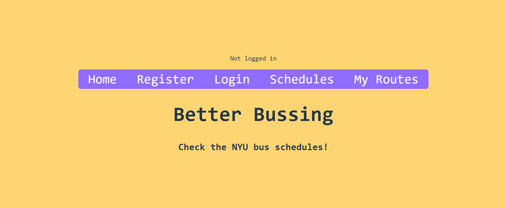
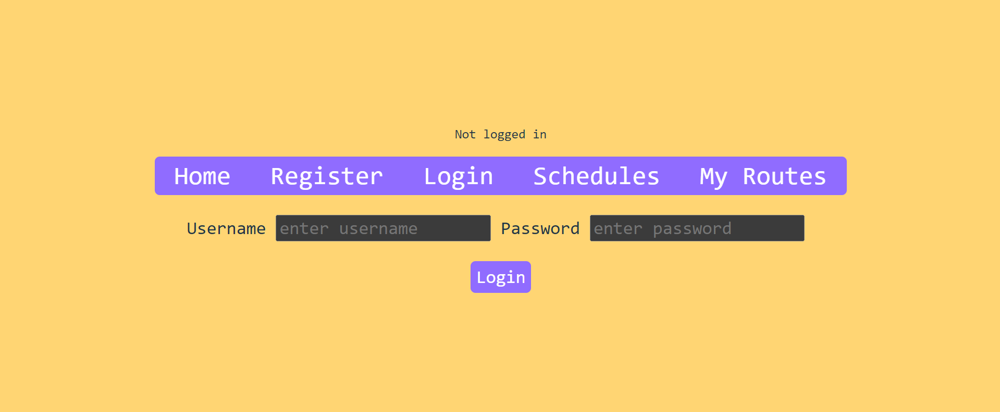
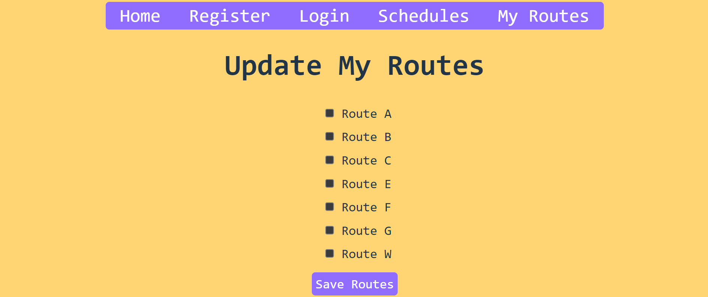

# Better Bussing

## Overview

Better Bussing displays all the NYU bus routes in one web app - no more clicking back and forth
through different websites to compare routes and times. Users can keep track of their
frequently used routes.

## Data Model

The application will store Users, Favorites and Schedules

* schedules will be created from google sheets files
* each user has list of favorite routes to track, each route corresponds to a schedule schema

An Example User:

```javascript
{
  username: "bobthebusser",
  password: // hashed password,
  favRoutes: [{
      _id: new ObjectId('662f33f50be39dfc83530098'),    
      route: 'Route B',
      stops: 'https://drive.google.com/open?id=1RFcpF009PyBT-E-FlfidOWe0Zi5n2mVD-dk988QiSoM',
      __v: 0
    },
    {
      _id: new ObjectId('662f33f50be39dfc8353009a'),    
      route: 'Route C',
      stops: 'https://docs.google.com/spreadsheets/d/1sI19tog5q2HvD62v8WK5mbz8gC4mPqxLwsLPDkcGgj4/edit?usp=sharing',
      __v: 0
    }]
}
```

An Example Schedule:

```javascript
{
  route: 'A',
  stops: link to google sheets,
}
```


## [Schema](server/db.mjs) 


## Site map

### can access these by navigation bar

*/ = home page


*/register = new user can register


*/login = user logs in ==> redirects to /myroutes


*/schedules = page that displays selected schedule, user doesn't have to login


*/myroutes = user's saved routes, if not logged in will ask user to login


### can access from myroutes page

*/myroutes/select = update user's saved routes, if not logged in will ask user to login


## User Stories or Use Cases

1. as non-registered user, I can look at schedules
2. as a user, I can log in to the site
3. as a user, I can view my saved routes and update them

## [Link to Initial Main Project File](server/app.mjs) 

## Annotations / References Used

1. [react tutorial](https://www.youtube.com/watch?v=XPC81RWOItI) - [client folder setup](client)
2. [passport tutorial](https://medium.com/signature-networks/learn-how-to-handle-authentication-with-node-using-passport-js-4a56ed18e81e) - [auth.mjs](server/auth.mjs), [loginUser function](server/controllers/controller.mjs)
