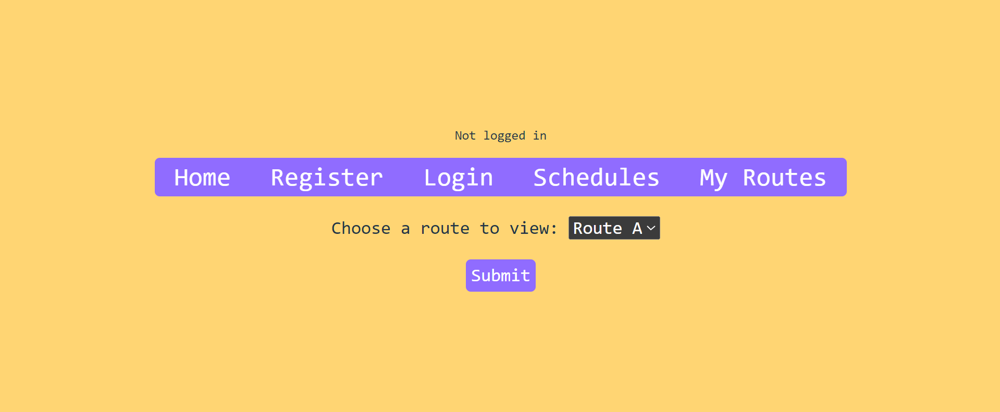

# Better Bussing

## Overview

Better Bussing displays all the NYU bus routes in one web app - no more clicking back and forth
through different spreadsheets to compare routes and times. Users can keep track of their
frequently used routes and bus stops, and updates for these routes will be displayed with a 
higher priority than the other messages. Users can also enter a start and end destination with
departure/arrival times, and Better Bussing will find show which bus route to take, if any (not sure about this yet).

## Data Model

The application will store Users, Favorites and Schedules

* schedules will be created from csv files containing stops and times
  * some routes have different schedules depending on day of the week, keep track of this somehow
* each user has list of favorite routes to track, each route corresponds to a schedule

An Example User:

```javascript
{
  username: "bobthebusser",
  hash: // a password hash,
  routes: [A,B]
}
```

An Example Schedule:

```javascript
{
  route: 'A',
  stops: ['715 Broadway', 'Broadway & Broome St', '80 Lafayette'],
  times: [['-','7:30','7:40'],['-','8:00','8:10'],['9:00','9:10','9:20']], // - means the bus does not stop there on this trip
  days: [Monday, Tuesday, Wednesday, Thursday] // Friday and weekends have different schedule
}
```


## [Link to Commented First Draft Schema](db.mjs) 


## Wireframes

(__TODO__: wireframes for all of the pages on your site; they can be as simple as photos of drawings or you can use a tool like Balsamiq, Omnigraffle, etc.)

/schedules - page displaying schedules, user doesn't have to log in



/myroutes - shows user's saved routes


/trip - user can plan trip


## Site map

can access these by navigation bar
/schedules = main page that just displays schedules and general updates
/myroutes/login = user logs in ==> /myroutes user's saved routes and updates about those routes
/trip = user can plan a trip

## User Stories or Use Cases

1. as non-registered user, I can look at schedules and all current updates
2. as non-registered user, I can plan a trip
3. as a user, I can log in to the site
4. as a user, I can view my saved routes and their updates are highlighted

## Research Topics

(__TODO__: the research topics that you're planning on working on along with their point values... and the total points of research topics listed)

* (4 points) Integrate user authentication
    * I'm going to be using passport for user authentication
    * see <code>...</code> for register page
    * see <code>...</code> for login page
* (6 points) Next.js
    * data fetching to get schedules
    * file-based routing
    * API routes - to google maps
* (1 point) google maps
    * use google maps for planning trip

10 points total out of 10 required points 

## [Link to Initial Main Project File](app.mjs) 

## Annotations / References Used

1. [passport.js authentication docs](http://passportjs.org/docs) - (add link to source code that was based on this)
